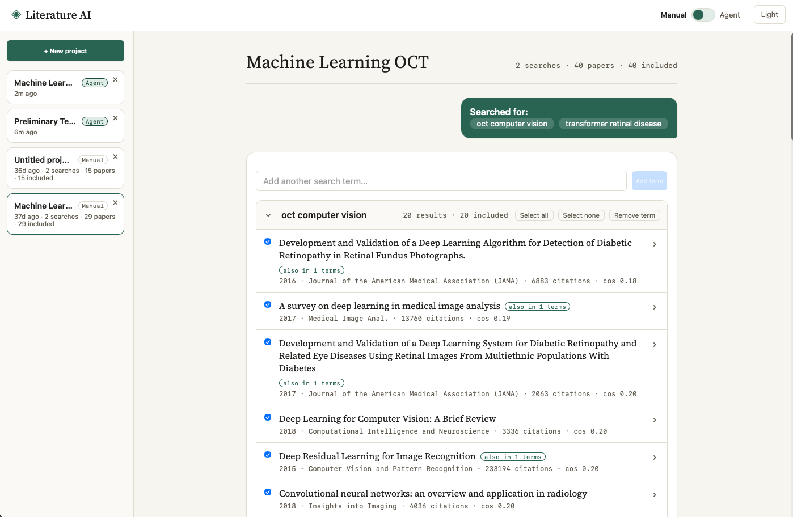
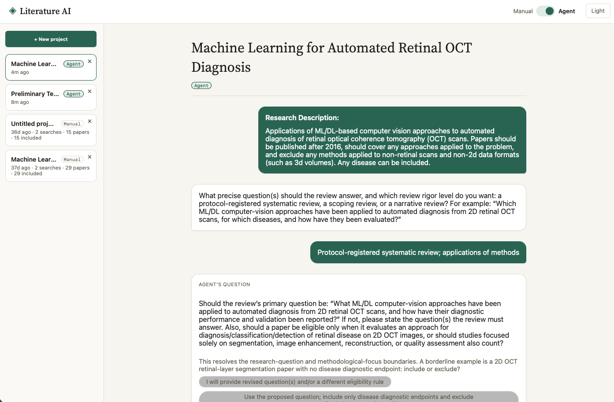
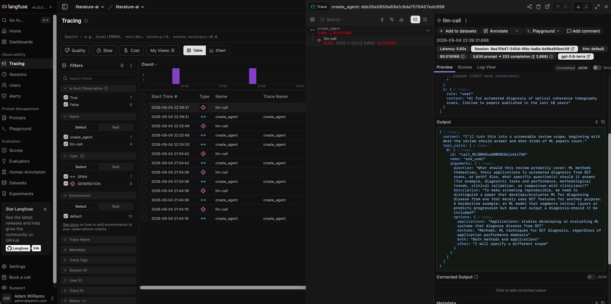

# (WIP) Agent-driven Systematic Reviews
[](https://github.com/adam-lw/Literature-Review-AI/actions)

- [(WIP) Agent-driven Systematic Reviews](#wip-agent-driven-systematic-reviews)
  - [Description](#description)
  - [Screenshots](#screenshots)
  - [Installation \& Usage](#installation--usage)
    - [Setup](#setup)
    - [Uninstall](#uninstall)
  - [Functionality Progress](#functionality-progress)
  - [Background](#background)
  - [Technical Description](#technical-description)
    - [Application Design](#application-design)
    - [Preliminary Data Collection](#preliminary-data-collection)
   

**Please check the `dev` branch for the latest changes!**

## Description

This project is an attempt to produce a fully end-to-end agentic approach to systematic review synthesis, while ensuring full human-in-the-loop visibility, and detailed logging & traceability to ensure confidence in the outputted results. It covers all steps in an end-to-end pipeline, from defining the bounds of the research & research questions, through to paper discovery, paper inclusion/exclusion assessment, and paper synthesis & validation.

The project was initially started with the goal of accurately and reliably synthesising literature reviews across any domain of research. This isn't a new goal - many AI research tools already exist including [Gemini Notebook](https://notebook.google) (formerly NotebookLM) by Google, or integrated AI tools in existing research apps like [Mendeley](https://www.mendeley.com/features#ai) - yet these tools often share some key weaknesses in common: the outputs of the AI are not necessarily reproducible or reliably correct, and when producing systematic review papers, researchers are often forced to manually intervene to validate & synthesise AI outputs into the desired format.

Transparency and reproducibility are critical when producing systematic reviews, which must clearly document their discovery approaches, inclusion/exclusion criteria & results with a PRISMA diagram, and reasoning behind each of these areas. Therefore, this project aims to set out to produce a system that would facilitate an end-to-end production of a systematic review paper, including full visibility and Human-in-the-Loop capabilities.

The project implements a full microservice architecture via Docker, including a stateless agent/LLM service, a RAG/paper storing service, an application layer for managing user projects, batch pipelines, a GROBID PDF parsing container, and a PostgreSQL + pgvector container for hosting the database. It heavily relies on OOP to ensure flexibility and maintainability, including easily extendible LLM/embeddings interfaces to allow for seamless integration of new models.

## Screenshots

**Manual Paper Semantic Search + Inclusion / Exclusion**


**Agent-Driven Project Scoping Assistant**


**Langfuse Integration**


## Installation & Usage
### Setup
1. Clone this repo and ensure you have Docker installed locally on your machine.
2. Initialise the project & its services with the below commands:
```
cd literature-ai
docker compose up
```
3. If you wish to use the AI-powered features, you may choose to paste your OpenAI/Anthropic API keys in .env. *Note: application currently defaults to OpenAI models only*
4. Navigate to the UI on `localhost:5173`

### Uninstall
To uninstall the project:
1. Run:
```
docker compose down
```
2. Delete this repo. It is entirely self-contained, so all collected & generated data is persisted within this file structure.

## Functionality Progress
The project is currently WIP - below is a summary of the completed functionality, as included in the `dev` branch.

- 🟢 **Data Collection & Processing** - Complete
  - Implemented pipeline for collecting bulk dataset for searching over, collected from Semantic Scholar's bulk API.

- 🟢 **Paper Semantic Search & Keyword Search** - Complete
  - Includes 5 optional embedding approaches and a full embedding comparison pipeline. Users can choose between the available embedding models in the UI.

- 🟢 **Application Layer & UI** - Complete
  - UI powered by React / Vite.js - offers an optional manual mode, and a stepwise agentic mode to allow users control over the search process and inclusion/exclusion criteria application.
  - Application layer persists user "projects", interfaces with a stateless agent service and the paper/RAG service.

- 🟢 **LLM Backend & Logging**
  - Integrates with Langfuse to provide trace logging.

- 🟢 **Project Scoping Agent** - Complete
  - Agent to work with the user to iteratively define the bounds & criteria for the 

- 🟢 **Chatbot Agent** - v1 Complete
  - Allows users to ask FAQs, query the paper findings, produce summarisations and other similar functionality.

- 🟢 **RAG Chunk & Paper Content Search**
  - Chunking of retrieved papers & semantic search over them for paper review & citation.

- 🟡 **Inclusion / Exclusion Criteria Assessment Agent** - Currently experimental

- 🟡 **Paper Writing Agent** - WIP

- 🔴 **Hybrid Search** - Not yet implemented


## Background

Agentic AI-powered applications have shown remarkable ability across a wide range of domains, though challenges remain in the application of these tools to accuracy-critical tasks, such as in forecasting and research, stemming from AI's inherently unstructured outputs and non-determinism. Difficulties include complexity surrounding the design and validation of agent systems, which must be validated to ensure agents follow instructions correctly & produce correct outputs; assessment of textual data, which is challenging to evaluate quantitatively, and challenges facing traditional ML systems, such as data & model drift.

Literature Reviews are research papers aimed at providing a summary of the current state of a research topic or field,  typically providing commentary on trends and gaps in the selected field. A cohort of papers is usually collected using specific procedures, including documentation of search terms used to query academic databases and precise inclusion/exclusion criteria applied on a paper-by-paper basis. This systematic approach to paper writing makes it a good candidate for recreation using an agentic system, as it provides benchmarks for both context selection (selecting appropriate research papers) and paper outcomes (summarisations and research gaps).

There some existing tools for the automated production of literature review papers. [SciSpace](https://effortlessacademic.com/scispace-an-all-in-one-ai-tool-for-literature-reviews/), [AnswerThis](https://www.thesisai.io), and [ThesisAI](https://www.thesisai.io) are three popular AI-driven platforms which offer paper collection and synthesis tools for researchers in academia. They all offer various forms of paper retrieval, typically using semantic search and/or a manual human selection approach, and they all offer an LLM-driven paper synthesis capability using Retrieval Augmented Generation (RAG) techniques. There are also several limitations these platforms all share - no platform rigorously nor transparently validates the collected inputs before paper synthesis, with no indication that inclusion/exclusion criteria are being considered, an essential component of a good literature review. SciSpace and AnswerThis offer the option of a manual inclusion/exclusion step, while ThesisAI does not offer one at all. No platforms offer automated refinement or fact checking of synthesised text after production, leaving papers with potential factual errors, incomplete sections, and poor stylisation.

Therefore, this project set out three key goals:
1. Ensure high quality, observable paper selection via explicit inclusion/exclusion criteria, validated against existing benchmarks.
2. Provide confidence in agentic execution through rigorous, observable validation of the agent's actions.
3. Provide iterative paper refinement, including fact checking against sources.

## Technical Description
### Application Design

The system and its control flow are implemented from scratch in Python. It relies on a mixture of an agentic & rules-based DAG to manage control flow, using a [ReAct](https://arxiv.org/abs/2210.03629)-like agent design with tool calling to manage execution and state. A flexible interface is made available allowing vendor-agnostic LLM, embedding, and paper collection tools, with OpenAI and Anthropic models currently being made available. An asynchronous design with asyncio is used throughout the application to allow concurrent agentic execution and efficient API usage. Langfuse is implemented for basic logging and observability, and a human-in-the-loop user interface is currently in development.

### Preliminary Data Collection

To build the dataset used to perform the selected semantic & keyword-based search approaches, Semantic Scholar's bulk paper collection API was used. This endpoint allows us to gather a large number of papers based on a set of query terms. For each query term, the N most cited papers within the specified date and journal quality score ranges are selected, followed by de-duplication and storage of paper metadata in a PostgreSQL database.

The title and abstract from each paper are then used to generate text embeddings, which are stored in a seperate Postgres database using pgvector, indexed using HNSW for faster searching. This is currently being experimentally combined with a keyword search approach (BM25) creating a hybrid search, due to the potential benefits of precise phrase matching during paper collection in a scientific context.

The reasoning behind this overall approach is partially down to several technical limitations. Firstly, there is an extremely large number of research papers - over 200 million - which obviously poses a technical limitation on the volume of papers that can be processed due to hardware & storage limitations. This has required me to significantly subset the overall search space by caching papers by topic, which may unintentionally exclude papers from a search. Secondly, semantic search begins to break down after the number of embeddings exceeds a certain point (~10^7) due to vector crowding, which forces the use of title and abstract embeddings only, rather than a full paper chunking approach.