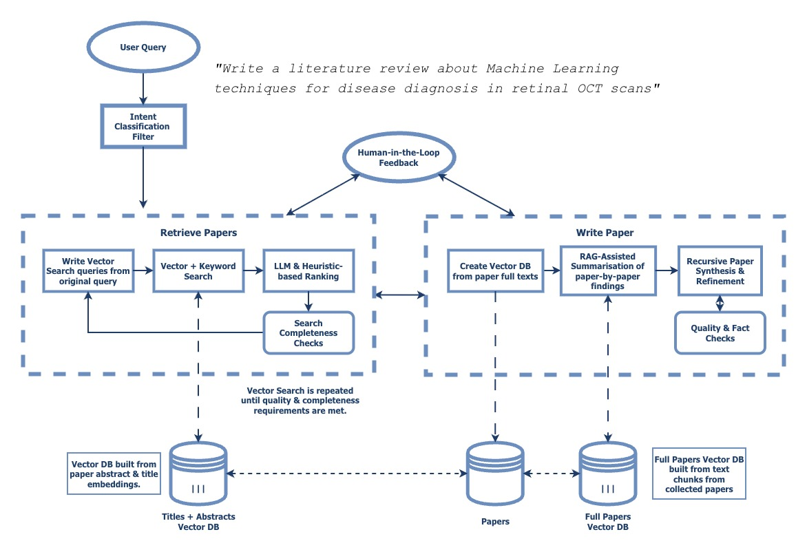

# (WIP) Literature AI : Agent-driven Literature Reviews

- [(WIP) Literature AI : Agent-driven Literature Reviews](#wip-literature-ai--agent-driven-literature-reviews)
  - [Description](#description)
  - [Background](#background)
  - [Technical Description](#technical-description)
    - [Application Design](#application-design)
    - [Preliminary Data Collection](#preliminary-data-collection)
    - [Agentic Paper Writing](#agentic-paper-writing)

## Description

*Literature AI* is an agent-powered tool for the automated writing of literature review, meta-analysis and systematic review papers. 

The project was started with two goals: to be able to replicate existing literature review papers, and to produce new literature reviews from scratch. Manually producing these papers is typically repetitive and time-intensive, diverting researchers' time and effort away from potentially more productive activities in their research. Therefore, this project aims to automate, or significantly accelerate, this task.

The tool leverages a hybrid keyword & semantic search for paper retrieval, AI-as-a-Judge & heuristic-based ranking for paper selection, and an agent-driven architecture for paper writing & assessment. The codebase is designed to be deployable in Docker/Kubernetes and will provide an API via FastAPI.

Particular care has been taken to ensure that results are accurate and reproducable. Effective evaluation and observability measures are essential in ensuring that users trust the outputs of the tool, especially given AI's known ability to "hallucinate" and produce inconsistent outputs. A combination of quantitative and qualitative evaluation approaches have been selected, including precision and recall for paper retrieval against benchmark papers, perplexity for textual outputs, AI-as-a-Judge assessment, and manual human review.

The project is currently WIP.

## Background

Agentic AI-powered applications have shown remarkable ability across a wide range of domains, though challenges remain in the application of these tools to accuracy-critical tasks, such as in forecasting and research, stemming from AI's inherently unstructured outputs and non-determinism. Difficulties include complexity surrounding the design and validation of agent systems, which must be validated to ensure agents follow instructions correctly & produce correct outputs; assessment of textual data, which is challenging to evaluate quantitatively, and challenges facing traditional ML systems, such as data & model drift.

Literature Reviews are research papers aimed at providing a summary of the current state of a research topic or field,  typically providing commentary on trends and gaps in the selected field. A cohort of papers is usually collected using specific procedures, including documentation of search terms used to query academic databases and precise inclusion/exclusion criteria applied on a paper-by-paper basis. This systematic approach to paper writing makes it a good candidate for recreation using an agentic system, as it provides benchmarks for both context selection (selecting appropriate research papers) and paper outcomes (summarisations and research gaps).

There some existing tools for the automated production of literature review papers. [SciSpace](https://effortlessacademic.com/scispace-an-all-in-one-ai-tool-for-literature-reviews/), [AnswerThis](https://www.thesisai.io), and [ThesisAI](https://www.thesisai.io) are three popular AI-driven platforms which offer paper collection and synthesis tools for researchers in academia. They all offer various forms of paper retrieval, typically using semantic search and/or a manual human selection approach, and they all offer an LLM-driven paper synthesis capability using Retrieval Augmented Generation (RAG) techniques. There are also several limitations these platforms all share - no platform rigorously nor transparently validates the collected inputs before paper synthesis, with no indication that inclusion/exclusion criteria are being considered, an essential component of a good literature review. SciSpace and AnswerThis offer the option of a manual inclusion/exclusion step, while ThesisAI does not offer one at all. No platforms offer automated refinement or fact checking of synthesised text after production, leaving papers with potential factual errors, incomplete sections, and poor stylisation.

Therefore, this project set out three key goals:
1. Ensure high quality, observable paper selection via explicit inclusion/exclusion criteria, validated against existing benchmarks.
2. Provide confidence in agentic execution through rigorous, observable validation of the agent's actions.
3. Provide iterative paper refinement, including fact checking against sources.

## Technical Description
### Application Design
**High-Level Conceptual Diagram**

The system and its control flow are implemented from scratch in Python. It relies on a mixture of an agentic & rules-based DAG to manage control flow, using a [ReAct](https://arxiv.org/abs/2210.03629)-like agent design with tool calling to manage execution and state. A flexible interface is made available allowing vendor-agnostic LLM, embedding, and paper collection tools, with OpenAI and Anthropic models currently being made available. An asynchronous design with asyncio is used throughout the application to allow concurrent agentic execution and efficient API usage. Langfuse is implemented for basic logging and observability, and a human-in-the-loop user interface is currently in development.

### Preliminary Data Collection

To build the dataset used to perform the selected semantic & keyword-based search approaches, Semantic Scholar's bulk paper collection API was used. This endpoint allows us to gather a large number of papers based on a set of query terms. For each query term, the N most cited papers within the specified date and journal quality score ranges are selected, followed by de-duplication and storage of paper metadata in a PostgreSQL database.

The title and abstract from each paper are then used to generate text embeddings, which are stored in a seperate Postgres database using pgvector, indexed using HNSW for faster searching. This is currently being experimentally combined with a keyword search approach (BM25) creating a hybrid search, due to the potential benefits of precise phrase matching during paper collection in a scientific context.

The reasoning behind this overall approach is partially down to several technical limitations. Firstly, there is an extremely large number of research papers - over 200 million - which obviously poses a technical limitation on the volume of papers that can be processed due to hardware & storage limitations. This has required me to significantly subset the overall search space by caching papers by topic, which may unintentionally exclude papers from a search. Secondly, semantic search begins to break down after the number of embeddings exceeds a certain point (~10^7) due to vector crowding, which forces the use of title and abstract embeddings only, rather than a full paper chunking approach.

To allow AI agents to collect papers in parallel without exceeding the API's rate limits, I have implemented a dispatcher/consumer architecture with asyncio which automatically manages concurrent requests from multiple agents, while exposing an easily configurable config for managing APIs. This is made available via a helper function, `call_api`.

### Agentic Paper Writing

The system uses a combination of a hard-coded rules-based DAG with an agentic architecture, coded fully from scratch in Python. Agents are allowed to call a limited set of tools, dictated by the controller, with tool calls potentially invoking further sub-agents and hard coded validation steps. Agents are implemented with a ReAct-like architecture (reflect, plan, act, repeat), using context summarisation to compress context and improve agent reliability.

RAG is used for paper synthesis, using a vector search across the retrieved papers. The papers were split into chunks, prepended with context about the paper itself, and encoded using an embedding model. 

