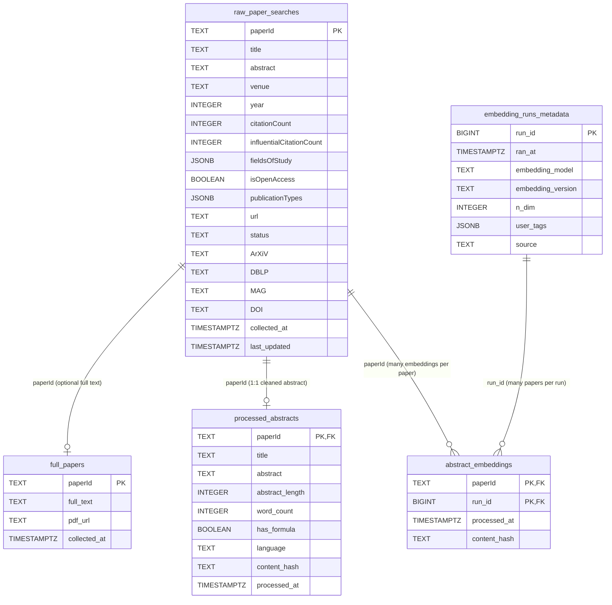

# Service Schema — Entity Relationship Diagram

## Schema overview

Two PostgreSQL schemas organise the tables:

| Schema | Purpose |
|---|---|
| `raw` | Data as received from upstream sources (Semantic Scholar API, open-access PDFs) |
| `processed` | Cleaned, enriched, and derived data produced by internal pipelines |

### Tables

| Table | Schema | Description |
|---|---|---|
| `raw_paper_searches` | `raw` | Papers retrieved from the Semantic Scholar bulk-search API. Central entity; all processed tables FK back here. |
| `full_papers` | `raw` | Full paper text downloaded from open-access PDF sources. Optional 1:1 with `raw_paper_searches`. |
| `processed_abstracts` | `processed` | Cleaned and enriched abstracts. Strict 1:1 with `raw_paper_searches`. |
| `embedding_runs_metadata` | `processed` | One row per distinct embedding run (model + version + dims + tags). Has a unique index to deduplicate runs. |
| `abstract_embeddings` | `processed` | Abstract embedding vectors. One row per (paperId, run_id). Embedding vector columns (e.g. `embedding_768 VECTOR(768)`) are added dynamically via `ALTER TABLE` when a new model dimension is first seen. |
