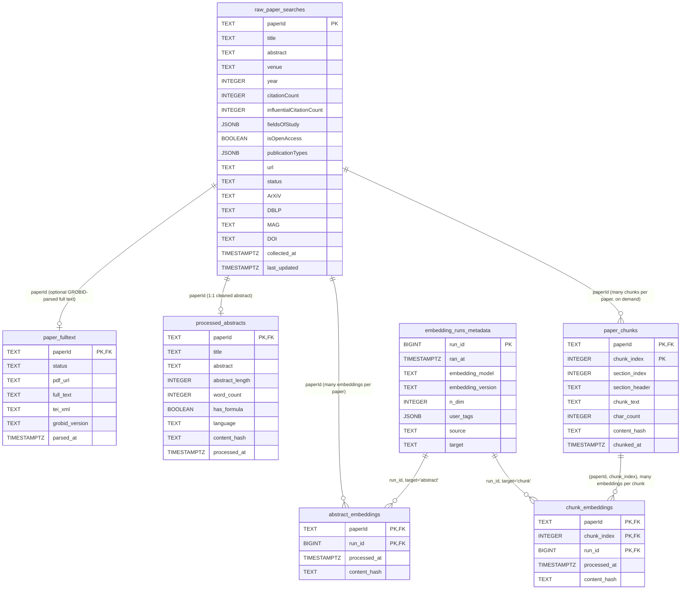

# Service Schema — Entity Relationship Diagram

## Schema overview

Two PostgreSQL schemas organise the tables:

| Schema | Purpose |
|---|---|
| `raw` | Data as received from upstream sources (Semantic Scholar API, open-access PDFs) |
| `processed` | Cleaned, enriched, and derived data produced by internal pipelines |

### Tables

| Table | Schema | Description |
|---|---|---|
| `raw_paper_searches` | `raw` | Papers retrieved from the Semantic Scholar bulk-search API. Central entity; all processed tables FK back here. |
| `paper_fulltext` | `raw` | Full paper text parsed from open-access PDFs via GROBID, fetched and cached on demand. Optional 1:1 with `raw_paper_searches`; `status` is `success` or `no_pdf_available` (transient fetch/parse failures are never persisted). |
| `processed_abstracts` | `processed` | Cleaned and enriched abstracts. Strict 1:1 with `raw_paper_searches`. |
| `embedding_runs_metadata` | `processed` | One row per distinct embedding run (model + version + dims + tags + target). Shared between abstract and chunk embedding runs; `target` (`abstract` or `chunk`) disambiguates which physical embeddings table a run's vectors live in. Has a unique index to deduplicate runs. |
| `abstract_embeddings` | `processed` | Abstract embedding vectors. One row per (paperId, run_id). Embedding vector columns (e.g. `embedding_768 VECTOR(768)`) are added dynamically via `ALTER TABLE` when a new model dimension is first seen. |
| `paper_chunks` | `processed` | Full-paper text chunked from GROBID-parsed body text. One row per (paperId, chunk_index), computed on demand the first time a paper is requested for chunk-scoped RAG search. Immutable once written (no incremental re-chunk); a manual delete forces re-chunking. |
| `chunk_embeddings` | `processed` | Chunk embedding vectors. One row per (paperId, chunk_index, run_id). Cannot reuse `abstract_embeddings` (whose PK is one row per paper); shares `embedding_runs_metadata` (via `target='chunk'`) and the same dynamic `embedding_{n_dim}` column pattern. FK to `paper_chunks` is `ON DELETE CASCADE`. |
